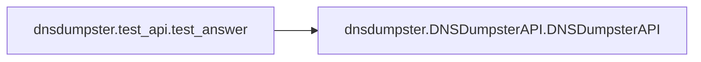

# Key Objects

[_Documentation generated by Documatic_](https://www.documatic.com)

<!---Documatic-section-dnsdumpster.test_api.test_answer-start--->
## dnsdumpster.test_api.test_answer

<!---Documatic-section-test_answer-start--->


### Object Calls

* dnsdumpster.DNSDumpsterAPI.DNSDumpsterAPI

<!---Documatic-block-dnsdumpster.test_api.test_answer-start--->
<details>
	<summary><code>dnsdumpster.test_api.test_answer</code> code snippet</summary>

```python
def test_answer():
    domain = 'uber.com'
    res = DNSDumpsterAPI(True).search(domain)
    assert len(res['dns_records']['host']) > 0
```
</details>
<!---Documatic-block-dnsdumpster.test_api.test_answer-end--->
<!---Documatic-section-test_answer-end--->

# #
<!---Documatic-section-dnsdumpster.test_api.test_answer-end--->

[_Documentation generated by Documatic_](https://www.documatic.com)